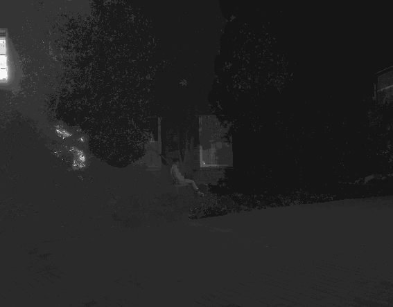

# Zero-Shot Image Enhancement Pipeline

<div align="center">

[](https://www.python.org/downloads/release/python-270/)
[](https://www.python.org/downloads/)
[](http://intrinsic.cs.cornell.edu)

** Low-Light Image Enhancement using Intrinsic Image Decomposition**

A pipeline combining intrinsic image decomposition with Multi-Scale Retinex enhancement and Structure Aware shading enhancement for superior low-light image recovery.

[Quick Start](#quick-start) • [Installation](#installation) • [Visual Results](#visual-results) • [Full Documentation](README_COMPREHENSIVE.md)

</div>

---

## Table of Contents

- [Overview](#overview)
- [Key Features](#key-features)
- [Visual Results](#visual-results)
- [How It Works](#how-it-works)
- [Installation](#installation)
- [Quick Start](#quick-start)
- [Enhancement Methods](#enhancement-methods)
- [Usage Examples](#usage-examples)
- [Project Structure](#project-structure)
- [Citation](#citation)
- [License](#license)

---

## Overview

This repository implements a **zero-shot image enhancement pipeline** that  improves the visibility and quality of low-light images without requiring any training data. The system leverages intrinsic image decomposition to separate reflectance (color properties) from shading (illumination), then applies **Structure-Aware Enhancement** and **Multi-Scale Retinex (MSR)** enhancement algorithms to recover details lost in dark regions essentially only enhancing the shading part keeping color properties intact.

**Core Technology**: Based on the SIGGRAPH 2014 paper "Intrinsic Images in the Wild" by Sean Bell, Kavita Bala, and Noah Snavely, extended with multiple enhancement methods including **Multi-Scale Retinex (MSR)** and **Structure-Aware Enhancement** for low-light enhancement.

**Recommended Methods**: Based on  evaluation across multiple datasets (MVTV, LLVIP), **Structure-Aware Enhancement** and **MSR Enhancement** consistently delivered the best results in most cases, with Structure-Aware achieving the highest quantitative metrics (SSIM: 0.81, PSNR: 22.88 dB) and MSR providing excellent visual quality with natural color preservation.

### What Makes This Special?

- **Zero-Shot**: No training required, works on any image immediately
- **Physically-Based**: Separates intrinsic image properties (reflectance vs. illumination)
- **Multiple Methods**: Five different enhancement algorithms to choose from
- **Production Ready**: Optimized C++ backend with Python interface
- **Batch Processing**: Parallel processing for efficient workflow

---

## Key Features

**Core Capabilities**
- Intrinsic image decomposition into reflectance and shading components
- Multi-Scale Retinex (MSR) enhancement for superior low-light recovery
- Structure-aware enhancement with edge-preserving filters
- Gamma correction, CLAHE, and simple reconstruction methods
- Parallel batch processing for multiple images
- color preservation during enhancement


---

## Visual Results

### Example 1: Outdoor Low-Light Scene

<div align="center">

<table>
<tr>
<td align="center"><b>Original Input</b><br>(Extremely Dark)</td>
<td align="center"><b>Reflectance Component</b><br>(Material Colors)</td>
<td align="center"><b>Shading Component</b><br>(Illumination)</td>
<td align="center"><b>MSR Enhanced</b><br>(Final Result)</td>
</tr>
<tr>
<td></td>
<td></td>
<td></td>
<td></td>
</tr>
</table>

</div>

### Example 2: Outdoor Scene Enhancement

<div align="center">

<table>
<tr>
<td align="center"><b>Original Input</b></td>
<td align="center"><b>Reflectance Component</b></td>
<td align="center"><b>Shading Component</b></td>
<td align="center"><b>MSR Enhanced</b></td>
</tr>
<tr>
<td></td>
<td></td>
<td></td>
<td></td>
</tr>
</table>

</div>

### Example 3: Complex Lighting Scenario

<div align="center">

<table>
<tr>
<td align="center"><b>Original Input</b></td>
<td align="center"><b>Reflectance Component</b></td>
<td align="center"><b>Shading Component</b></td>
<td align="center"><b>MSR Enhanced</b></td>
</tr>
<tr>
<td></td>
<td></td>
<td></td>
<td></td>
</tr>
</table>

</div>


### Quantitative Results on LLVIP Dataset

Performance comparison of different enhancement methods against ground truth images from the **LLVIP (Low-Light Visible-Infrared Paired) dataset** (evaluated on 358 images):

| Method | SSIM ↑ | PSNR (dB) ↑ | MSE ↓ | Rank |
|--------|--------|-------------|-------|------|
| **Structure-Aware Enhanced** | **0.8100** | **22.88** | **646.34** | 1st |
| **Gamma Enhanced** | 0.7977 | 22.40 | 726.65 | 2nd |
| **MSR Enhanced** | 0.7785 | 21.81 | 815.67 | 3rd |
| **Reconstructed (Simple)** | 0.7641 | 19.51 | 925.17 | 4th |
| **CLAHE Enhanced** | 0.7074 | 19.95 | 837.87 | 5th |

**Key Findings:**
- Structure-aware enhancement achieves the best quantitative metrics with highest SSIM (0.81) and PSNR (22.88 dB)
- All methods show significant improvement over the original low-light images
- Lower MSE values indicate better reconstruction accuracy

**Datasets Used:**
- **MVTV Dataset**: Multi-View Television dataset for visual quality demonstration
- **LLVIP Dataset**: Low-Light Visible-Infrared Paired dataset for quantitative evaluation

### LLVIP Dataset Example

<div align="center">

<table>
<tr>
<td align="center"><b>Original Low-Light Input</b></td>
<td align="center"><b>Structure-Aware Enhanced</b></td>
</tr>
<tr>
<td></td>
<td></td>
</tr>
</table>

**LLVIP Dataset**: Low-light visible images paired with infrared images for comprehensive evaluation. The structure-aware enhancement method achieved the best quantitative results (SSIM: 0.81, PSNR: 22.88 dB) on this challenging dataset.

</div>

---

## How It Works

The enhancement pipeline operates in three main stages:

### Stage 1: Intrinsic Image Decomposition

The input image **I** is decomposed into two fundamental components:

```
I(x,y) = R(x,y) × S(x,y)
```

Where:
- **R(x,y)** = Reflectance ( color, texture, albedo)
- **S(x,y)** = Shading (illumination, shadows, lighting effects)

This separation uses:
1. Dense feature extraction (color, texture, edges)
2. Learned classifiers for reflectance/shading judgments
3. Dense CRF optimization for global consistency
4. Edge-preserving refinement

### Stage 2: Component Enhancement

The shading component is enhanced using one of five methods:

**Multi-Scale Retinex (MSR)** - Recommended
```
MSR(x,y) = Σᵢ wᵢ [log(S(x,y)) - log(Gσᵢ * S(x,y))]
```
- Simulates human visual system's color constancy
- Multiple scales (σ = 15, 80, 250) capture different illumination patterns
- Robust to varying lighting conditions

**Other Methods Available:**
- Structure-aware enhancement (preserves fine details)
- Gamma correction (simple brightness adjustment)
- CLAHE (local contrast enhancement)
- Simple reconstruction (baseline)

### Stage 3: Reconstruction

The enhanced shading is recombined with the original reflectance:

```
I_enhanced(x,y) = R(x,y) × S_enhanced(x,y) × brightness_factor(change it as per your need)
```

This preserves original material colors while  improving visibility.

---

## Installation

### Prerequisites

- **Operating System**: Linux (Ubuntu/Debian recommended) or macOS
- **Python**: 2.7 (for decomposition) and 3.9+ (for enhancement)
- **Conda**: For environment management
- **System Libraries**: Eigen3, build-essential

### Automated Setup (Recommended)

The easiest way to get started:

```bash
# Clone the repository
git clone https://github.com/shaurya2524/Zero_Shot_Low_Light_enhancing.git
cd Zero_Shot_Enhancement

# Run automated setup
chmod +x setup.sh
./setup.sh
```

The script will:
1. Install system dependencies (Eigen3, build tools)
2. Create two conda environments (`intrinsic_env` and `enhancement_env`)
3. Install all required Python packages
4. Compile C++ extensions
5. Verify the installation

### Manual Installation

If you prefer manual installation:

#### Step 1: Install System Dependencies

**Ubuntu/Debian:**
```bash
sudo apt-get update
sudo apt-get install libeigen3-dev build-essential
```

**macOS:**
```bash
brew install eigen
```

#### Step 2: Create Python Environments

**Intrinsic Decomposition Environment (Python 2.7):**
```bash
conda create -n intrinsic_env python=2.7 -y
conda activate intrinsic_env
pip install Pillow cython==0.19.2 numpy==1.8.0 scipy==0.13.2 scikit-image==0.9.3 scikit-learn==0.14.1
```

**Enhancement Pipeline Environment (Python 3.9+):**
```bash
conda create -n enhancement_env python=3.9 -y
conda activate enhancement_env
pip install -r requirements.txt
```

#### Step 3: Compile C++ Extensions

```bash
conda activate intrinsic_env
cd bell2014/krahenbuhl2013/
make
cd ../..
```

### Verify Installation

```bash
# Test intrinsic decomposition
conda activate intrinsic_env
python -c "import numpy; import scipy; print('Intrinsic environment OK')"

# Test enhancement pipeline
conda activate enhancement_env
python -c "import cv2; import cv2.ximgproc; print('Enhancement environment OK')"
```

---

## Quick Start

### Single Image Processing

Process a single image through the complete pipeline:

```bash
# Step 1: Decompose the image into reflectance and shading
conda activate intrinsic_env
cd bell2014/
python decompose.py ../images/your_image.png
cd ..

# Step 2: Enhance the components
conda activate enhancement_env
python enhancing_script.py \
    --input_dir shading_reflectance/ \
    --output_dir results/ \
    --brightness 9.0
```

### Batch Processing

For processing multiple images efficiently:

```bash
conda activate intrinsic_env
cd bell2014/
./multi_images.sh ../images/ ../output/ ../shading_reflectance/ 4
```

Parameters:
- `../images/` - Input directory containing images
- `../output/` - Output directory for intermediate results
- `../shading_reflectance/` - Directory for decomposed components
- `4` - Number of parallel processes (adjust based on CPU cores)

### View Results

After processing, your results will be organized in separate directories:

```
results/
├── msr_enhanced/          # Best quality - MSR enhanced images (RECOMMENDED)
├── enhanced/              # Structure-aware enhanced images
├── gamma_enhanced/        # Gamma correction enhanced images
├── clahe_enhanced/        # CLAHE enhanced images
└── reconstructed/         # Simple reconstruction (baseline)
```

**Tip**: Use images from `msr_enhanced/` for best results.

---

## Enhancement Methods

The pipeline provides five different enhancement methods:

### 1. Multi-Scale Retinex (MSR) - Recommended

**Best for**: Low-light enhancement, color preservation, general use

The method that simulates the human visual system's ability to perceive constant colors under varying illumination.

**Parameters**:
```bash
--msr_sigmas "15,80,250"  # Small, medium, large scales
```

**Advantages**: Superior detail recovery, excellent color preservation, minimal artifacts

### 2. Structure-Aware Enhancement

**Best for**: Preserving fine details, texture-rich images

Separates shading into base illumination and detail layers using edge-preserving filters.

**Parameters**:
```bash
--lambda 6000.0    # Edge-preserving filter strength
--gamma 1.5        # Enhancement gamma
--sigma 15.0       # Color similarity threshold
```

**Advantages**: Excellent detail preservation, no halo artifacts

### 3. Gamma Correction

**Best for**: Quick enhancement, simple brightness adjustment

Applies power-law transformation to the shading component.

**Parameters**:
```bash
--simple_gamma 1.7  # Gamma value
```

**Advantages**: Fast processing, simple and predictable

### 4. CLAHE (Contrast Limited Adaptive Histogram Equalization)

**Best for**: Local contrast enhancement

Adaptive histogram equalization with contrast limiting.

**Parameters**:
```bash
--clahe_clip_limit 2.0      # Contrast limiting threshold
--clahe_tile_grid "8,8"     # Tile size for local processing
```

**Advantages**: Excellent local contrast, adaptive to image content

### 5. Simple Reconstruction

**Best for**: Baseline comparison, minimal processing

Direct multiplication of reflectance and enhanced shading.

**Advantages**: Fastest method, no artifacts, good baseline

---

## Usage Examples

### Custom Enhancement Parameters

Fine-tune the enhancement for your specific use case:

```bash
python enhancing_script.py \
    --input_dir shading_reflectance/ \
    --output_dir custom_results/ \
    --brightness 8.0 \
    --msr_sigmas "10,50,200" \
    --gamma 1.8 \
    --lambda 8000.0 \
    --sigma 20.0
```

### Parameter Tuning Guide

| Parameter | Effect | Recommended Range | Default |
|-----------|--------|-------------------|---------|
| `--brightness` | Overall brightness multiplier | 1.0 - 15.0 | 8.0 |
| `--msr_sigmas` | MSR scale factors | "10,50,200" to "20,100,300" | "15,80,250" |
| `--gamma` | Structure-aware gamma | 1.2 - 2.0 | 1.5 |
| `--lambda` | Edge-preserving strength | 3000.0 - 10000.0 | 6000.0 |
| `--sigma` | Color similarity | 10.0 - 25.0 | 15.0 |

### Python API Usage

Integrate the pipeline into your own projects:

```python
import cv2
from pathlib import Path
from enhancing_script import reconstruct_with_msr_enhancement

# Process a single image
reflectance_path = Path('shading_reflectance/image-r.png')
shading_path = Path('shading_reflectance/image-s.png')

# MSR enhancement
msr_result = reconstruct_with_msr_enhancement(
    reflectance_path, 
    shading_path, 
    msr_sigmas=[15, 80, 250],
    brightness_factor=9.0
)

# Save result
cv2.imwrite('output_msr.png', msr_result)
```

---

## Project Structure

```
Zero_Shot_Enhancement/
├── README.md                      # This file
├── QUICK_START.md                # Quick start guide
├── README_COMPREHENSIVE.md       # Detailed technical documentation
├── requirements.txt              # Python dependencies
├── setup.sh                      # Automated setup script
│
├── bell2014/                     # Intrinsic decomposition module
│   ├── decompose.py             # Main decomposition script
│   ├── solver.py                # Core solver implementation
│   ├── input.py                 # Input processing
│   ├── params.py                # Parameter management
│   ├── energy/                  # Energy functions
│   └── krahenbuhl2013/          # Dense CRF implementation
│
├── enhancing_script.py          # Main enhancement pipeline
├── clahe_inference.py           # CLAHE-specific enhancement
│
├── images/                      # Input images
├── shading_reflectance/         # Decomposed components (R, S)
├── msr_enhanced/                # MSR enhanced outputs
├── enhanced/                    # Structure-aware outputs
├── gamma_enhanced/              # Gamma correction outputs
├── clahe_enhanced/              # CLAHE outputs
├── reconstructed/               # Simple reconstruction outputs
│
└── docs/                        # Documentation and examples
    └── images/                  # README images
```


## Troubleshooting

### Common Issues

**Python version mismatch**
- Intrinsic decomposition requires Python 2.7 (legacy code from 2014 paper)
- Enhancement pipeline uses Python 3.9+ (modern dependencies)
- Use separate conda environments as shown in setup

**OpenCV ximgproc not found**
```bash
pip uninstall opencv-python opencv-python-headless
pip install opencv-contrib-python
```

**Eigen3 not found during compilation**
```bash
# Ubuntu/Debian
sudo apt-get install libeigen3-dev

# macOS
brew install eigen
```

**Terminal app not found in multi_images.sh**
- Edit `TERMINAL_APP` variable in `bell2014/multi_images.sh`
- Common options: `gnome-terminal`, `konsole`, `xterm`, `terminator`

For more troubleshooting help, see [README_COMPREHENSIVE.md](README_COMPREHENSIVE.md) or [QUICK_START.md](QUICK_START.md).

